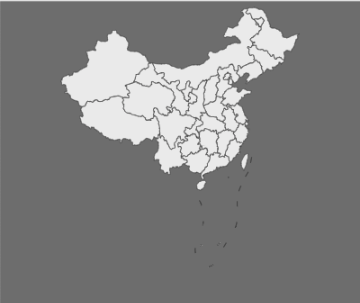
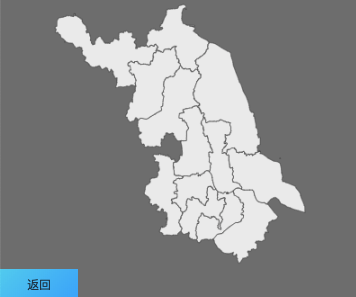

# react-echarts-chinamap

> 

[](https://www.npmjs.com/package/react-echarts-chinamap) [](https://standardjs.com)

## 安装

```bash
npm install --save react-echarts-chinamap
```

## 使用

```jsx
import React, { Component } from 'react'

import ReactChinaMap from 'react-echarts-chinamap'

class Example extends Component {
  handleOnChange = (data) => {
    console.log(data) // 此时data是用户点击的区域的名称数组
  }
  render () {
    return (
      <ReactChinaMap onChange={this.handleOnChange} />
    )
  }
}
```
## 使用截图
### 1业务界面中初次加载组件(背景色可自己按需求添加)

### 2点击某省时的界面(这里以点击江苏省为例,组件展示江苏省轮廓，点击市可继续显示被点击的市的轮廓)

## 组件参数
| 参数| 说明|  类型  |默认值|
| -------- | -----:  | :----:  |:----:|
| onChange| 点击地图模块时的回调函数 |function(data:Array)|-|
| extraOption|用户自定义的对echarts的配置项|Object|{}|
| style| 自定义的style |Object|{}|
|wrapperClassName|自定义的加在组件最外层的样式名称|String|-|
|echartsClassName|自定义的加载echarts组件上的样式名称|String|-|
|showCallbackBtn|是否显示返回按钮|Boolean|true|
|showTips|是否在点击到最后一次地区时显示提示语|Boolean|true|
|defaultSelectedAreaName|默认选中高亮的区域的名称|string|''|
|isShowIsland|是否显示南海群岛及南海轮廓线|Boolean|true|
## License

MIT © [zjz1993](https://github.com/zjz1993)
